# Sumando Capacidades

Aplicación web full stack para la gestión del voluntariado de una ONG ficticia orientada a favorecer la **inclusión, la autonomía y la participación en la comunidad de personas con discapacidad**.

El proyecto fue desarrollado originalmente como **Trabajo de Fin de Grado del Ciclo Formativo de Grado Superior en Desarrollo de Aplicaciones Web (DAW)** y posteriormente revisado y actualizado para mejorar su diseño, organización, funcionamiento y presentación.

---

## Índice

- [Descripción](#descripción)
- [Objetivos](#objetivos)
- [Funcionalidades](#funcionalidades)
- [Tipos de usuario](#tipos-de-usuario)
- [Tecnologías utilizadas](#tecnologías-utilizadas)
- [Arquitectura del proyecto](#arquitectura-del-proyecto)
- [Capturas de pantalla](#capturas-de-pantalla)
  - [Página de inicio](#página-de-inicio)
  - [Voluntariado](#voluntariado)
  - [Inicio de sesión](#inicio-de-sesión)
  - [Área personal](#área-personal)
  - [Administración](#administración)
  - [Noticias](#noticias)
  - [Contacto](#contacto)
- [Instalación y ejecución](#instalación-y-ejecución)
- [Credenciales de demostración](#credenciales-de-demostración)
- [Configuración local](#configuración-local)
- [Base de datos](#base-de-datos)
- [Seguridad](#seguridad)
- [Responsive Design](#responsive-design)
- [Estado del proyecto](#estado-del-proyecto)
- [Autoría](#autoría)

---

## Descripción

**Sumando Capacidades** es una plataforma web diseñada para facilitar la gestión de actividades de voluntariado y la participación de personas voluntarias en una organización social.

La aplicación permite consultar actividades, registrarse como voluntario, gestionar inscripciones, consultar mensajes y acceder a diferentes herramientas de administración según el rol del usuario.

La identidad de **Sumando Capacidades** es ficticia y ha sido creada con fines académicos y de portfolio.

La propuesta se articula alrededor de tres conceptos principales:

- **Inclusión**
- **Autonomía**
- **Comunidad**

## Enlaces

- **Repositorio:** [GitHub](https://github.com/gmp395/pe-gestion-ong-tfg)
- **Demo:** [GitHub Pages](https://gmp395.github.io/pe-gestion-ong-tfg/)

> La demo publicada en GitHub Pages permite visualizar la interfaz de la aplicación. Las funcionalidades que requieren conexión con el backend deben ejecutarse en entorno local.

---

## Objetivos

Los principales objetivos del proyecto son:

- Facilitar el acceso a actividades de voluntariado.
- Permitir el registro y autenticación de usuarios.
- Gestionar la inscripción de voluntarios en actividades.
- Diferenciar funcionalidades según el rol del usuario.
- Facilitar la comunicación entre usuarios y administración.
- Gestionar propuestas y participantes desde un panel administrativo.
- Mantener una interfaz clara, accesible y responsive.
- Aplicar una arquitectura frontend/backend separada.
- Integrar persistencia de datos mediante una base de datos relacional.

---

## Funcionalidades

### Funcionalidades públicas

- Página de inicio informativa.
- Consulta de actividades de voluntariado.
- Consulta de noticias.
- Consulta de directrices y recursos.
- Formulario de contacto.
- Registro de nuevos usuarios.
- Inicio de sesión.
- Recuperación de contraseña.

### Área de usuario

Una vez autenticado, el usuario puede:

- Consultar su perfil.
- Inscribirse en actividades.
- Consultar sus próximas actividades.
- Cancelar una inscripción.
- Consultar sus mensajes.
- Consultar las respuestas recibidas desde la organización.
- Cerrar sesión.

### Área de administración

Los usuarios con rol de administrador pueden:

- Gestionar propuestas de actividades.
- Aprobar propuestas y convertirlas en actividades programadas.
- Rechazar propuestas.
- Consultar participantes inscritos en las actividades.
- Gestionar los mensajes recibidos mediante el formulario de contacto.
- Responder consultas.
- Crear, modificar y eliminar noticias.

---

## Tipos de usuario

La aplicación contempla dos roles principales:

### Voluntario

Puede registrarse, iniciar sesión, consultar actividades y gestionar su participación.

### Administrador

Dispone de funcionalidades adicionales para gestionar contenidos, propuestas, participantes y comunicaciones.

---

## Tecnologías utilizadas

### Frontend

- Angular
- TypeScript
- HTML5
- CSS3
- Angular Router
- RxJS
- Responsive Design

### Backend

- Java 21
- Spring Boot
- Spring Web
- Spring Security
- Spring Data JPA
- JWT
- BCrypt
- WebSocket
- Spring Mail

### Base de datos

- MariaDB 11

### Herramientas

- Docker
- Docker Compose
- Maven
- npm
- Git
- GitHub
- Visual Studio Code

---

## Arquitectura del proyecto

El proyecto está dividido en dos aplicaciones principales:

```text
pe-gestion-ong-tfg/
│
├── backend/
│   ├── db/
│   ├── src/
│   ├── Dockerfile
│   ├── docker-compose.yml
│   ├── pom.xml
│   └── mvnw
│
├── frontend/
│   ├── public/
│   ├── src/
│   ├── angular.json
│   ├── package.json
│   └── package-lock.json
│
├── screenshots/
│
├── .env.example
├── .gitignore
└── README.md
```

### Frontend

Angular se encarga de:

- interfaz de usuario;
- navegación;
- formularios;
- gestión de sesión en cliente;
- consumo de la API REST;
- representación de actividades, noticias y mensajes.

### Backend

Spring Boot se encarga de:

- autenticación;
- autorización;
- generación y validación de JWT;
- gestión de usuarios;
- gestión de actividades;
- inscripciones;
- noticias;
- mensajes;
- acceso a MariaDB.

---

# Capturas de pantalla

Las imágenes siguientes se muestran como miniaturas.  
Haz clic sobre cualquiera de ellas para verla a tamaño completo.

---

## Página de inicio

La página principal presenta la identidad de **Sumando Capacidades**, su propósito y las diferentes formas de participación.

<p align="center">
  <a href="screenshots/01-home.png">
    
  </a>
  <a href="screenshots/02-home.png">
    
  </a>
  <a href="screenshots/03-home-formas-sumar.png">
    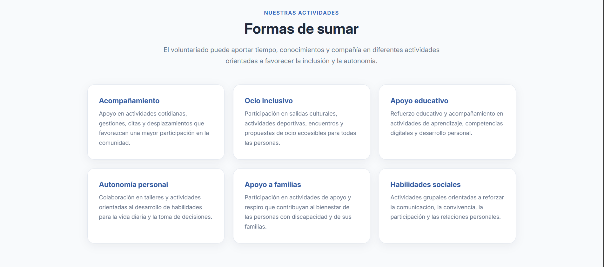
  </a>
</p>

---

## Voluntariado

La sección de voluntariado permite consultar las actividades disponibles, sus características y las plazas correspondientes.

<p align="center">
  <a href="screenshots/04-voluntariado-mobile-1.png">
    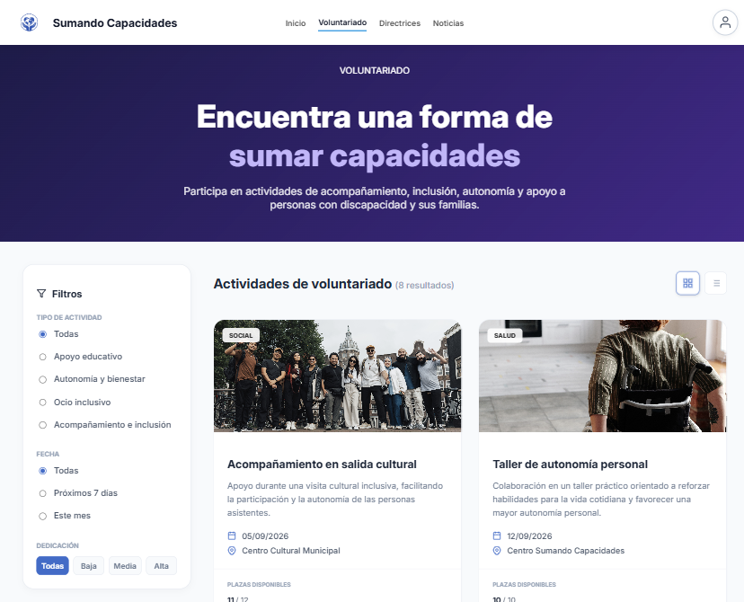
  </a>
  <a href="screenshots/05-voluntariado-mobile-2.png">
    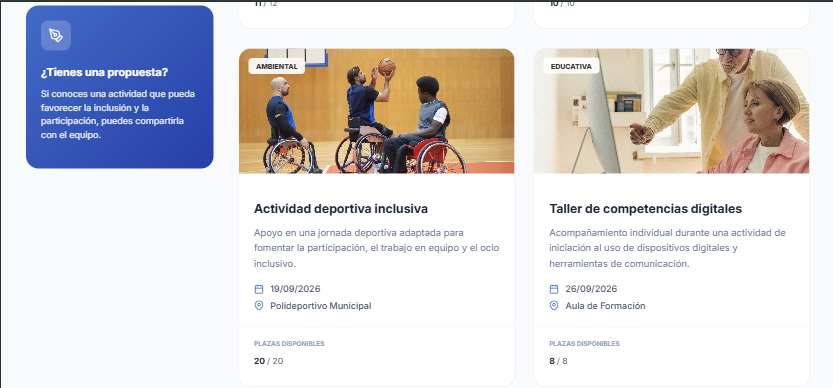
  </a>
  <a href="screenshots/06-voluntariado-mobile-3.png">
    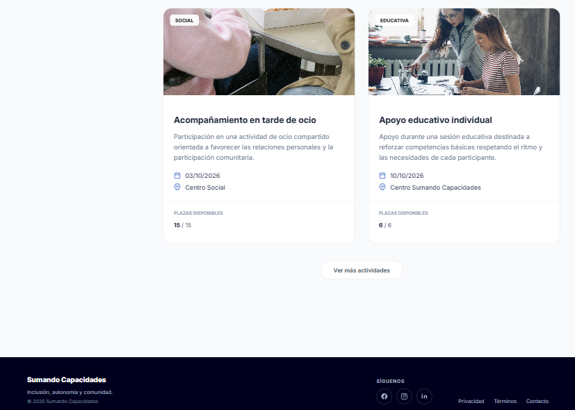
  </a>
</p>

---

## Inicio de sesión

Los usuarios registrados pueden acceder a su área personal mediante correo electrónico y contraseña.

<p align="center">
  <a href="screenshots/07-login-desktop.png">
    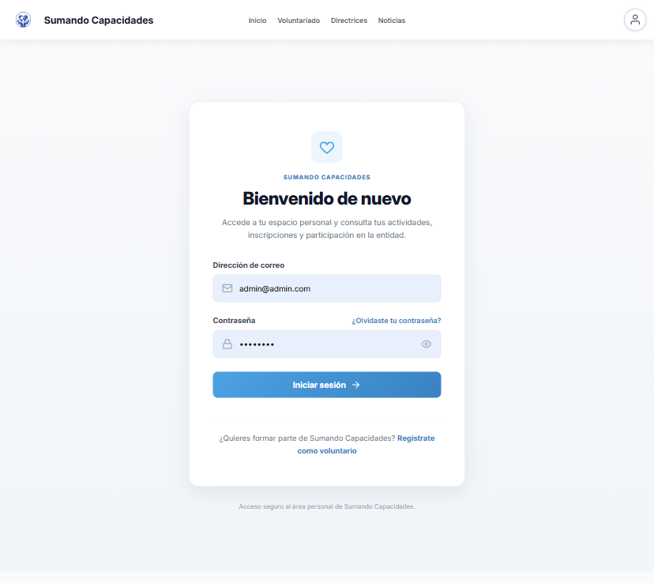
  </a>
</p>

---

## Área personal

### Mis actividades

El usuario puede consultar las actividades en las que está inscrito y gestionar su participación.

<p align="center">
  <a href="screenshots/08-mis-actividades.png">
    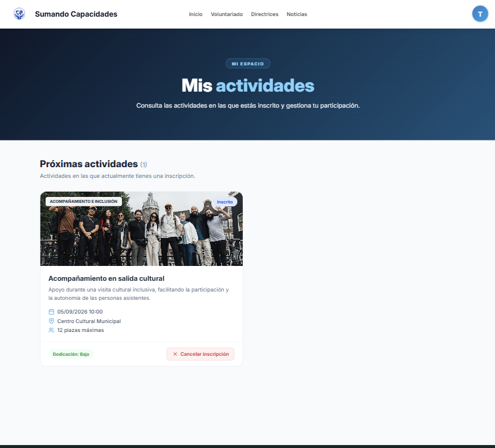
  </a>
</p>

### Mis mensajes

Los usuarios pueden consultar las consultas enviadas y las respuestas recibidas desde la organización.

<p align="center">
  <a href="screenshots/09-mis-mensajes.png">
    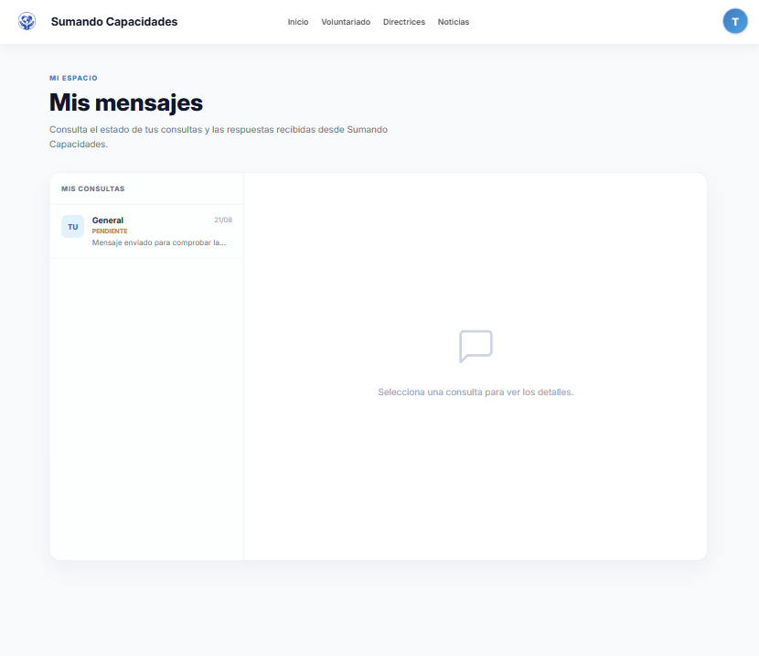
  </a>
</p>

---

## Administración

El menú de administración se muestra únicamente a usuarios con rol `admin`.

### Gestión de propuestas

Permite revisar actividades propuestas antes de incorporarlas a la programación.

<p align="center">
  <a href="screenshots/10-gestion-propuestas.png">
    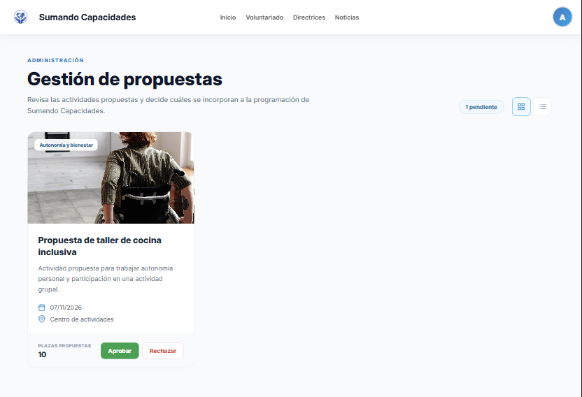
  </a>
</p>

### Control de participantes

Permite consultar qué usuarios están inscritos en cada actividad.

<p align="center">
  <a href="screenshots/11-control-participantes.png">
    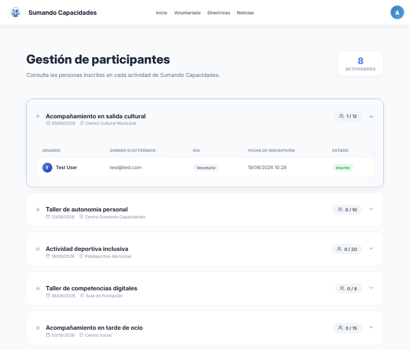
  </a>
</p>

### Bandeja de mensajes

Permite consultar y responder los mensajes enviados mediante el formulario de contacto.

<p align="center">
  <a href="screenshots/12-bandeja-mensajes.png">
    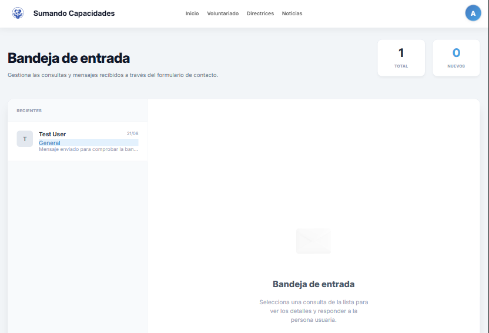
  </a>
</p>

---

## Noticias

La aplicación incluye una sección de noticias. Los administradores pueden gestionar su contenido.

<p align="center">
  <a href="screenshots/13-noticias1.png">
    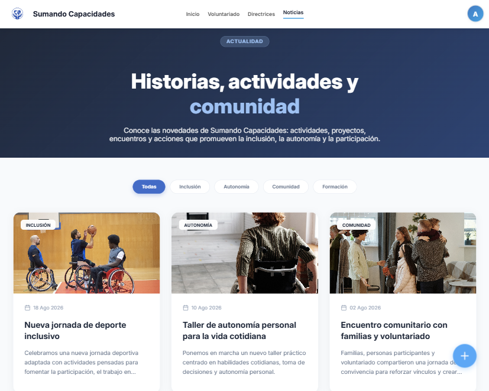
  </a>
  <a href="screenshots/14-noticias2.png">
    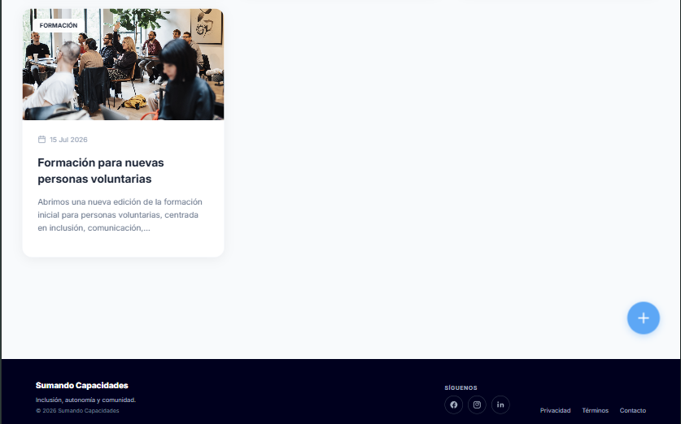
  </a>
</p>

---

## Contacto

El formulario de contacto permite enviar consultas que posteriormente pueden ser gestionadas desde el área de administración.

<p align="center">
  <a href="screenshots/15-contacto.png">
    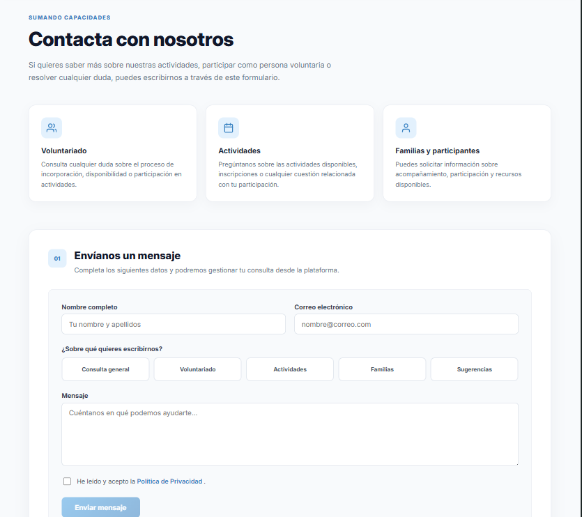
  </a>
</p>

---

# Instalación y ejecución

## Requisitos previos

Para ejecutar el proyecto es necesario disponer de:

- Java 21
- Node.js
- npm
- Docker Desktop
- Git

---

## 1. Clonar el repositorio

```bash
git clone https://github.com/gmp395/pe-gestion-ong-tfg.git
```

Acceder al proyecto:

```bash
cd pe-gestion-ong-tfg
```

---

## 2. Base de datos

La base de datos MariaDB se ejecuta mediante Docker.

Accede al backend:

```bash
cd backend
```

Inicia MariaDB:

```bash
docker compose up -d
```

Puedes comprobar que el contenedor está funcionando con:

```bash
docker ps
```

Debería aparecer:

```text
gestion_voluntarios_ong
```

escuchando en el puerto:

```text
3306
```

---

## 3. Configuración del backend

El proyecto utiliza variables para evitar almacenar credenciales sensibles en el repositorio.

Existe un archivo de ejemplo:

```text
.env.example
```

Para desarrollo local puede utilizarse un archivo:

```text
backend/src/main/resources/application-local.properties
```

Este archivo está incluido en `.gitignore` y **no debe subirse al repositorio**.

Ejemplo de configuración:

```properties
spring.datasource.username=dev
spring.datasource.password=dev

jwt.secret=TU_SECRETO_JWT_LOCAL

spring.mail.username=TU_USUARIO_MAIL
spring.mail.password=TU_PASSWORD_MAIL

server.port=8082
```

---

## 4. Ejecutar el backend

Desde:

```bash
cd backend
```

ejecuta:

```bash
./mvnw spring-boot:run -Dspring-boot.run.profiles=local
```

En Windows también puede utilizarse:

```bash
mvnw.cmd spring-boot:run -Dspring-boot.run.profiles=local
```

El backend estará disponible en:

```text
http://localhost:8082
```

---

## 5. Ejecutar el frontend

Abre una segunda terminal.

Accede a:

```bash
cd frontend
```

Instala las dependencias si es la primera ejecución:

```bash
npm install
```

Inicia Angular:

```bash
npm start
```

La aplicación estará disponible en:

```text
http://localhost:4200
```

---

# Credenciales de demostración

Para probar las funcionalidades de administración se incluye una cuenta de demostración:

```text
Email: admin@admin.com
Contraseña: admin123
```

La contraseña se almacena en la base de datos mediante BCrypt.

> Estas credenciales pertenecen exclusivamente al entorno de demostración del proyecto y no deben reutilizarse en un entorno real.

Los usuarios voluntarios pueden crearse desde el formulario de registro de la propia aplicación.

---

# Configuración local

La configuración principal del backend se encuentra en:

```text
backend/src/main/resources/application.properties
```

Las credenciales y configuraciones específicas de cada máquina deben mantenerse fuera del repositorio.

El archivo:

```text
application-local.properties
```

está ignorado mediante `.gitignore`.

También se ignoran:

```text
.env
node_modules/
target/
dist/
.angular/
.vscode/
*.log
```

---

# Base de datos

La aplicación utiliza **MariaDB 11**.

El script de inicialización se encuentra en:

```text
backend/db/001_init.sql
```

Entre las principales tablas se encuentran:

```text
users
activities
users_activities
noticias
guidelines
contact_messages
chat_messages
```

Las relaciones permiten asociar usuarios con actividades y gestionar la participación de los voluntarios.

---

# Seguridad

La aplicación implementa:

- Spring Security.
- Autenticación mediante JWT.
- Contraseñas cifradas mediante BCrypt.
- Roles `volunteer` y `admin`.
- Restricción de endpoints según rol.
- Gestión de sesión mediante token.
- Variables locales para información sensible.
- Configuración CORS para la comunicación entre Angular y Spring Boot.

Las credenciales sensibles no deben almacenarse directamente en el repositorio.

---

# Responsive Design

La interfaz ha sido diseñada para adaptarse a diferentes tamaños de pantalla.

Se han trabajado específicamente:

- navegación responsive;
- tarjetas de actividades;
- formularios;
- área personal;
- noticias;
- panel administrativo;
- footer;
- distribución y jerarquía de contenidos.

La adaptación a dispositivos móviles forma parte de los requisitos principales del proyecto.

---

# Estado del proyecto

Actualmente se encuentran implementadas y comprobadas las principales funcionalidades:

- [x] Registro de usuarios
- [x] Inicio y cierre de sesión
- [x] Autenticación mediante JWT
- [x] Roles de usuario
- [x] Consulta de actividades
- [x] Inscripción en actividades
- [x] Cancelación de inscripciones
- [x] Área personal
- [x] Gestión de propuestas
- [x] Control de participantes
- [x] Gestión de noticias
- [x] Formulario de contacto
- [x] Bandeja de mensajes
- [x] Respuestas a consultas
- [x] Directrices y recursos
- [x] Diseño responsive
- [x] Persistencia con MariaDB
- [x] Configuración mediante Docker
- [x] Compilación frontend y backend verificada

### Funcionalidades sujetas a configuración externa

El sistema de recuperación de contraseña utiliza correo electrónico y requiere configurar las credenciales correspondientes del servicio SMTP utilizado en cada entorno.

---

# Autoría

Proyecto desarrollado originalmente como **Trabajo de Fin de Grado del Ciclo Formativo de Grado Superior en Desarrollo de Aplicaciones Web (DAW)**.

**Vicente Arnal González**

**Gema Miguel**  
[GitHub](https://github.com/gmp395)

---

## Nota

**Sumando Capacidades** es una organización ficticia creada exclusivamente para este proyecto académico.

Los nombres, contenidos, actividades y datos mostrados en la aplicación tienen finalidad demostrativa y no representan a una entidad real.